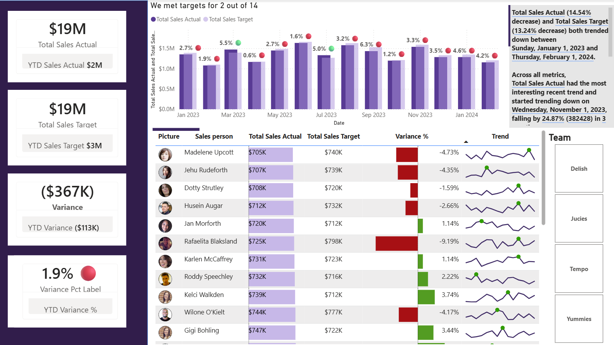
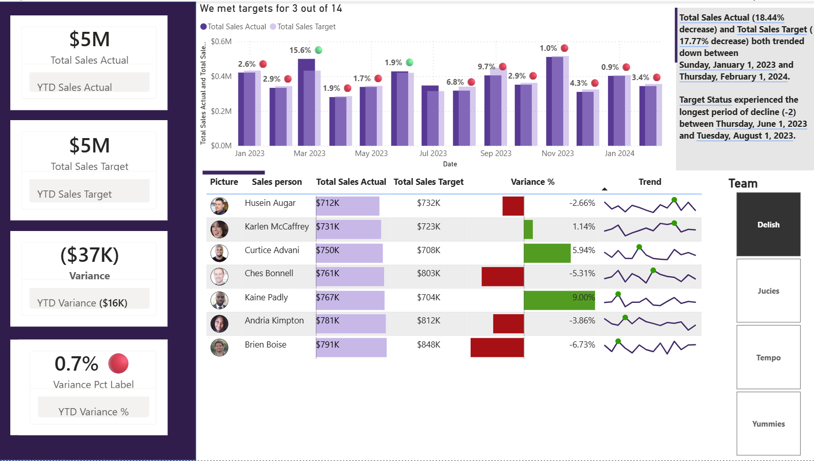
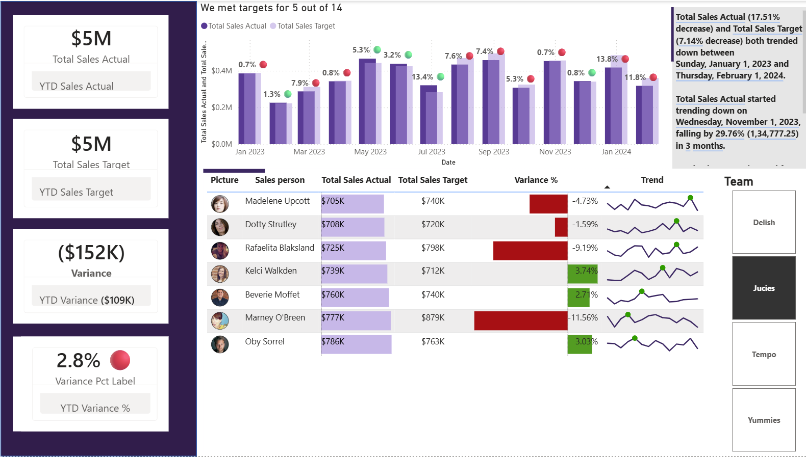
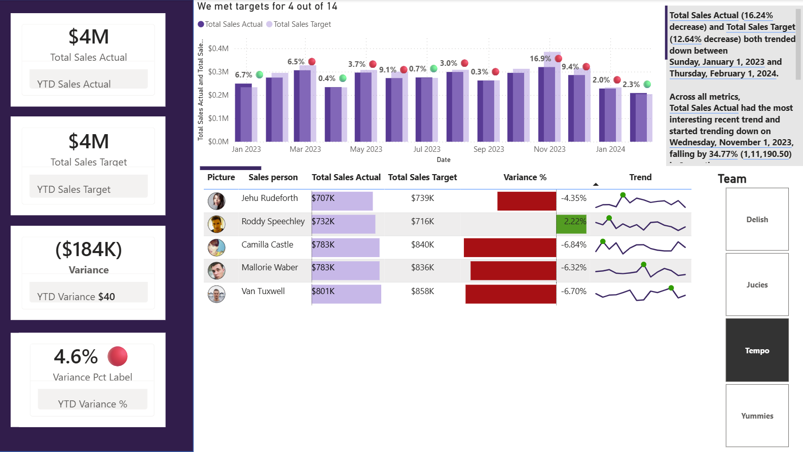
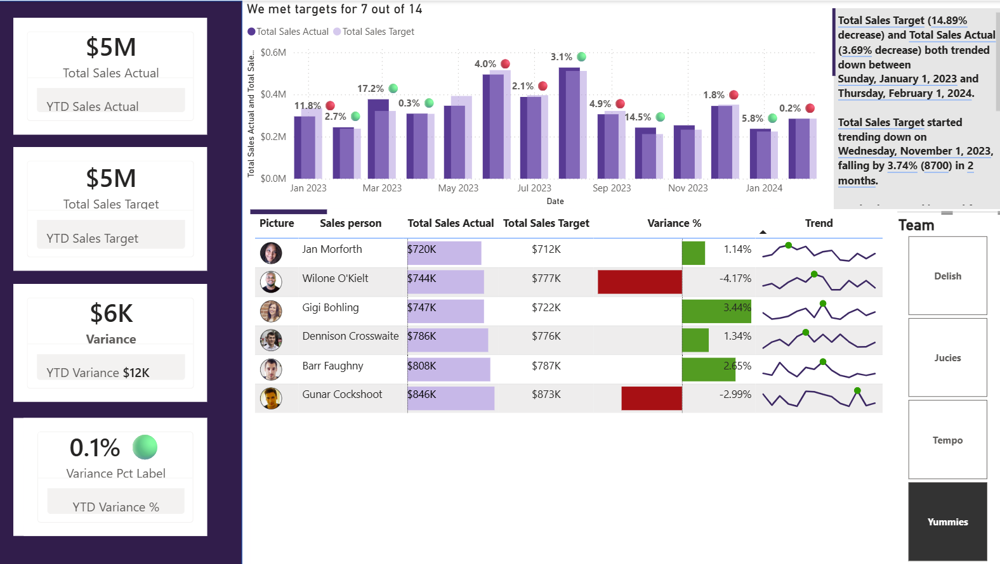

# CashDash — Finance KPI Dashboard

CashDash is a beginner-friendly **Power BI Business Intelligence project** that tracks financial performance using Actual vs Target metrics.

It demonstrates data cleaning, modeling, and DAX calculations to create an interactive dashboard for business insights.

---

## Features

- Actual vs Target tracking
- Year-to-Date (YTD) calculations
- Variance % analysis
- Smart narrative insights
- Trend sparklines and lipstick charts

---

## Tools and Technologies

- Power BI
- Power Query (ETL)
- DAX
- Excel / CSV dataset

---

## Workflow

### 1) Data Transformation

- Cleaned raw financial data using Power Query  
- Used **Unpivot** to convert wide tables into long format

---

### 2) Data Modeling

- Built a **Star Schema**
- Fact tables: Sales
- Dimension tables: Calendar, Teams

---

### Data Model















---

### 3) DAX Measures

```DAX
Total Sales Actual = SUM(Actual[Value])
Total Sales Target = SUM(Targets[Value])

YTD Actuals = TOTALYTD(SUM(Actual[Value]), 'Calendar'[Date])
YTD Targets = TOTALYTD(SUM(Targets[Value]), 'Calendar'[Date])

YTD Variance = [YTD Actuals] - [YTD Targets]
YTD Variance % = DIVIDE([YTD Variance], [YTD Targets], 0)
